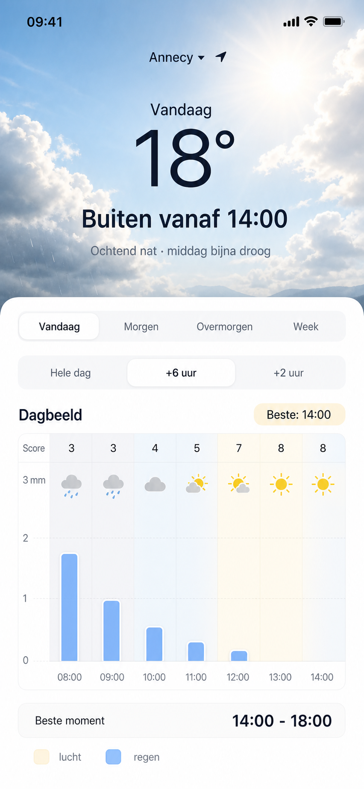

# Rainplay

Rainplay is a simple iPhone-first vacation weather web app. It is not meant to be a full weather app. Its job is to answer one practical question:

> Can we go outside now, should we wait a few hours, or is tomorrow better?

The app combines the emotional feel of a weather app with the usefulness of a decision tool. The first screen should feel like looking outside: sky, sun, clouds, temperature, and a clear recommendation. Under that, a simple timeline shows rain amount, sky brightness, and an outdoor score.

## Commando's

```bash
# Installeer dependencies
npm install

# Start de ontwikkelserver (http://localhost:5173)
npm run dev

# Bouw voor productie (voert eerst tests + typecheck uit)
npm run build

# Preview de productiebuild lokaal
npm run preview

# Controleer code op stijlfouten
npm run lint

# Draai alle tests (eenmalig)
npm test

# Draai één testbestand (eenmalig)
npm run test:unit

# Draai tests in watch-modus
npm run test:watch

# Draai tests met coverage rapport
npm run test:coverage

# Typecheck zonder bouwen
npm run typecheck

# Volledige validatie: lint + tests + typecheck + build
npm run validate
```

Het HTML-coverage rapport staat na `npm run test:coverage` in `coverage/index.html`.

Coverage drempelwaardes: 80% statements/lines, 75% functions, 70% branches.

## Current Direction

Build Rainplay as a **React + TypeScript Progressive Web App**.

Reasoning:

- It can be used on iPhone without an Apple Developer license.
- It can be added to the iPhone Home Screen from Safari.
- It is easy to share with the user's partner.
- The app mainly needs UI, weather data, location, charts, and decision logic.
- A native iOS app can come later if the concept deserves App Store distribution.

## North Star Design

Primary reference:



The latest design combines:

- a soft photographic weather header for the real "weather feeling";
- location selector with a default GPS/current location;
- current temperature and simple outdoor advice;
- day selector: `Vandaag`, `Morgen`, `Overmorgen`, `Week`;
- horizon selector: `Hele dag`, `+6 uur`, `+2 uur`;
- one combined graph for sky/brightness, rain amount, and outdoor score;
- a best outdoor window, for example `14:00 - 18:00`.

## Product Principles

- Keep it simple enough to use on vacation.
- Design for decisions, not meteorological completeness.
- The first screen should answer the question without requiring interaction.
- Rain amount in millimeters matters more than only rain chance.
- Avoid activity-specific language such as cycling. This is a general "outside / op pad" app.
- Avoid bottom tabs for the initial version.
- Keep the design close to iOS / Apple Weather: airy, calm, premium, readable.
- The graph should feel light and intuitive, not like a finance or analytics dashboard.

## Core Screens

For the first version, build one main screen:

- Header with sky/weather image, location, temperature, and advice.
- Day selector: today, tomorrow, day after tomorrow, week.
- Horizon selector: whole day, next 6 hours, next 2 hours.
- Main chart with hourly blocks.
- Best moment summary.

Optional later screens:

- Location picker.
- Settings for score sensitivity.
- Week overview.
- Weather data attribution/about view.

## Data Source

Use **Open-Meteo** as the primary weather API:

- Forecast API: https://open-meteo.com/en/docs
- KNMI model docs via Open-Meteo: https://open-meteo.com/en/docs/knmi-api

Open-Meteo is preferred because it offers:

- worldwide coordinate-based forecasts;
- no API key needed for prototyping / non-commercial use;
- simple JSON suitable for a browser app;
- hourly precipitation amount, precipitation probability, cloud cover, solar radiation, wind, and temperature;
- automatic best-match model selection;
- KNMI HARMONIE/AROME model support for the Netherlands and parts of Europe.

Direct KNMI Data Platform usage is not the first choice for this app because much of the useful model data is exposed as GRIB, HDF5, or NetCDF, which is less practical for a simple React PWA.

## Useful Open-Meteo Fields

Current:

- `temperature_2m`
- `apparent_temperature`
- `precipitation`
- `rain`
- `showers`
- `weather_code`
- `cloud_cover`
- `wind_speed_10m`
- `wind_gusts_10m`

Hourly:

- `temperature_2m`
- `apparent_temperature`
- `precipitation`
- `precipitation_probability`
- `rain`
- `showers`
- `cloud_cover`
- `shortwave_radiation`
- `sunshine_duration`
- `weather_code`
- `wind_speed_10m`
- `wind_gusts_10m`
- `is_day`

Daily:

- `temperature_2m_max`
- `temperature_2m_min`
- `sunrise`
- `sunset`
- `sunshine_duration`
- `precipitation_sum`
- `precipitation_probability_max`
- `wind_speed_10m_max`
- `wind_gusts_10m_max`

## Outdoor Score

The app should expose a simple 0-10 outdoor score per hour, but hide the formula from the main UI.

Initial scoring inputs:

- rain amount;
- rain probability;
- wind speed and gusts;
- apparent temperature;
- cloud cover;
- shortwave radiation / sunshine duration;
- daylight.

The score should support the recommendation text:

- `Buiten vanaf 14:00`
- `Wacht tot de middag`
- `Nu goed naar buiten`
- `Morgen beter`
- `Binnenmoment`

## Visual Model For The Graph

Use one graph, not separate sun and rain graphs.

Graph layers:

1. Hourly background blocks for sky/brightness.
2. Rain bars over the background.
3. Thin white border/halo around rain bars.
4. Left y-axis in millimeters.
5. Hour labels along the x-axis.
6. Small score row at the top.

Sky blocks should be subtle:

- pale gray-blue for rainy/cloudy;
- soft blue for brighter/cloudy;
- pale warm yellow for sunny;
- pale blue-gray for evening.

## Initial Tech Stack

Recommended:

- React
- TypeScript
- Vite
- PWA manifest
- Jotai for client/UI state
- TanStack Query for weather API/server state
- Zod for runtime API response validation
- CSS modules or plain CSS, depending on project size
- Open-Meteo API
- Browser geolocation API

Keep dependencies light. For the chart, prefer a custom SVG/CSS implementation first because the visual design is specific and simple.

## App Architecture

- `src/providers/AppProviders.tsx` wires the explicit Jotai app store and TanStack Query client.
- `src/state/` contains client state atoms such as selected day, horizon, and location.
- `src/queries/` contains React Query hooks.
- `src/api/` contains external API adapters, starting with Open-Meteo.
- `src/api/schemas/` contains Zod schemas for Open-Meteo API responses. All `response.json()` calls are validated here before normalisation. Types are derived via `z.infer<>` — there are no parallel handwritten types.
- `src/design/tokens.css` contains design tokens for color, radius, spacing, shadows, and typography.
- `src/screens/WeatherScreen.tsx` owns the first product screen.

### iOS screen fill (read before touching layout/viewport CSS)

The app fills the iPhone screen by pinning `.app-shell` with `position: fixed; inset: 0` and painting the sky as a separate fixed background — **never** with a `vh/svh/dvh/lvh`/`%` height, because none of those is reliable on an iOS 26 standalone PWA at cold launch. This is subtle and cost many regressions; the full rationale, the exact CSS, every failed approach, and the on-device diagnostics are documented in [`docs/architecture/ios-viewport-fill.md`](docs/architecture/ios-viewport-fill.md). Do not change the viewport strategy without reading it and reproducing on a real iPhone (desktop Chrome cannot reproduce the bug).

## Attribution

Open-Meteo uses open data and requires attribution. Include a small, unobtrusive attribution somewhere appropriate:

`Weather data by Open-Meteo`
